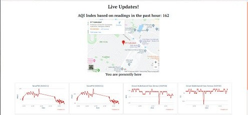
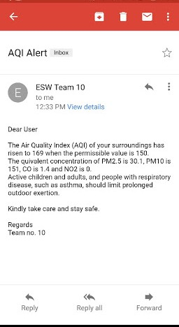
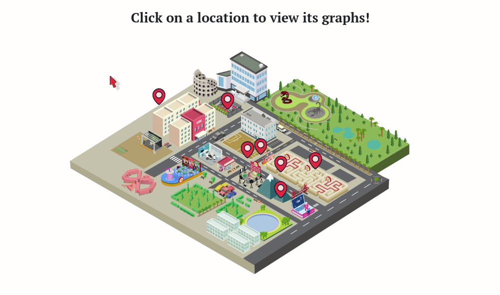
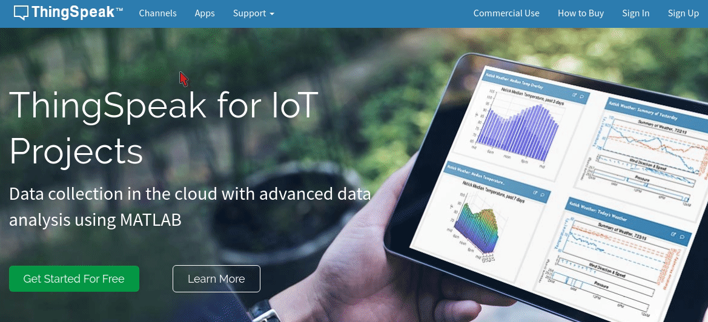
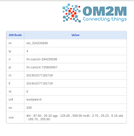

# Indoor Air Pollution Monitoring System (Mobile)

A mobile indoor air quality monitoring system for measuring humidity, temperature, volatile organic compounds, particulate matter and detecting concentration of various gases.

## Getting Started

These instructions will get you a copy of the project up and running on your local machine. You will be able to access: 
-   Live Dashboard
-   Webite
-   Thingspeak channels for both the nodes
-   OneM2M server containing data

## Prerequisites

You will need *Python 3* to run the Flask application for the Live Dashboard, it can be installed on Ubuntu/Debian using the following command: 

```bash
$ sudo apt-get install python3 python3-pip
```
The other requirements can be installed as follows:

```bash
$ cd Indoor-Air-Pollution-Monitoring-System 
$ cd Live_Dashboard 
$ sudo -H pip install -r requirements.txt
```

You will need *Arduino 1.8.9* or above along with the appropriate libraries included for the sensors to flash the code onto the NodeMCU.

## Libraries Used

The following are the libraries included in the Arduino code for obtaining data from the node and sending it to the OneM2M server as well as Thingspeak.

```c
//Libraries required for OneM2M communication
#include <JSONVar.h>
#include <Arduino_JSON.h>
#include <JSON.h>
#include <Wire.h>
#include <stdlib.h>

//Sensor Libraries
#include "Adafruit_SGP30.h"
#include "MutichannelGasSensor.h"
#include "SdsDustSensor.h"
#include "DHT.h"
#include "sgp30.h"
#include "sensirion_common.h"
#include <Adafruit_Sensor.h>
#include <SDS011.h>

//Libraries required for Thingspeak communication
#include <ThingSpeak.h>
#include <ESP8266HTTPClient.h>
#include <ESP8266WiFi.h>
#include <SoftwareSerial.h>
#include <Arduino.h>
```

## Live Dashboard

The Live Dashboard contains real-time data in the form of SI Unit vs Time graphsas well the calculated `AQI`.

The Flask application can be run with the following commands after cloning this reposirory.

```bash
$ cd Indoor-Air-Pollution-Monitoring-System 
$ cd Live_Dashboard 
$ sudo -H pip install -r requirements.txt
$ python3 run.py
```
This will start the server and and the user will see a line as follows:

```bash
Running on http://127.0.0.1:5000/ (Press CTRL+C to quit)
```

Click on the `HTTP` link to acces the dashboard!



## Email Alert System

Add the format of the file to enter username of users of the Email Alert service here.



## Website

The Website contains a map of International Institute Of Information Technology, Hyderabad's campus and the graphs of data collected by the node at different indoor locations during three important time slots:

- Before Diwali&nbsp;&nbsp;&nbsp;&nbsp;&nbsp;&nbsp;*Friday 7/10/2019*
- During Diwali&nbsp;&nbsp;&nbsp;&nbsp;&nbsp;&nbsp;*Saturday 8/10/2019*
- After Diwali&nbsp;&nbsp;&nbsp;&nbsp;&nbsp;&nbsp;&nbsp;&nbsp;&nbsp;*Sunday 9/10/2019*



## Thingspeak

1. Visit the homepage for [Thingspeak](thingspeak.com) <br>
2. Choose [Channels]() from the nav bar at the top and search for the following channel numbers corresponding to sensors in the 2 nodes!

Channels for first node:
```c
873276      //DHT Sensor
873290      //VoC and eCO2 Sensor
873271      //Nova PM Sensor
873290      //Grove Multichannel Gas Sensor
```

Chanel numbers for second node: 
```c
905895      //DHT Sensor
905904      //VoC and eCO2 Sensor
905893      //Nova PM Sensor
905902      //Grove Multichannel Gas Sensor
```



## OneM2M

Insert method of setting up own server here when we figure out how to!

For now: 
1.  Visit [onem2m.iiit.ac.in/webpage](onem2m.iiit.ac.in/webpage)
2.  Enter `admin` as the username
3.  Enter `admin` as the password
4.  Select *Team 10* and click on the instances under the respective nodes to view the data collected.
   

<br>


## To Do

- [ ] Scrape data from OneM2M directly instead of Thingspeak
- [ ] Improve the UI/UX of the Live Dashboard
  
## License
## Authors

@ainsley2000
@jyotisunkara
@shradhasehgal


